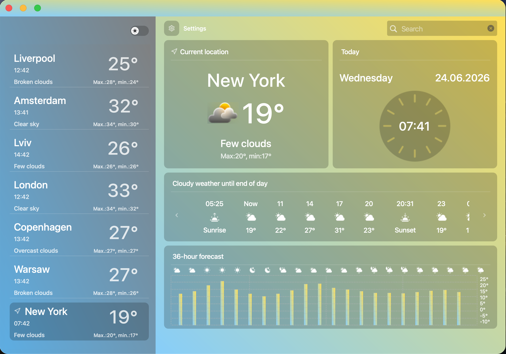
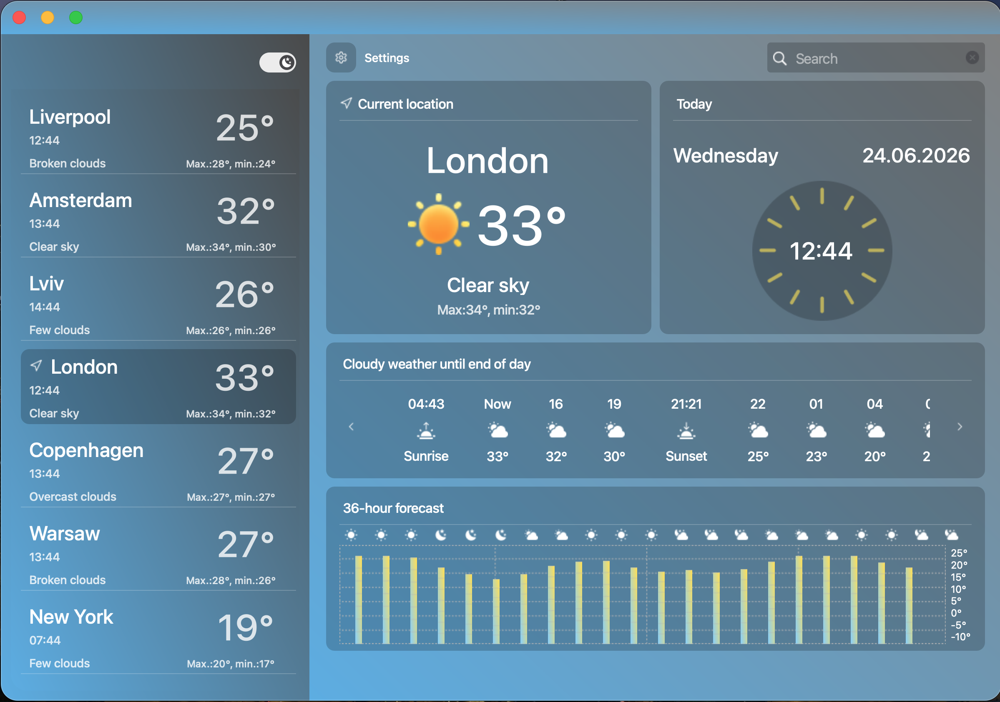
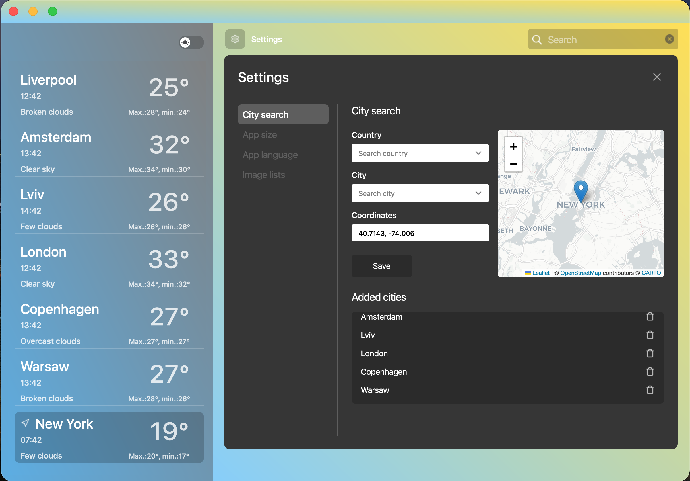

# 🌤️ Weather App

---

<div align="center">

[🇬🇧 English](#-english) / [🇺🇦 Українська](#-українська)

</div>

---

<a id="-english"></a>
## 🇬🇧 English

---

## Table of Contents

1. [Project Goal](#-project-goal)
2. [Team](#-team)
3. [File Structure](#-file-structure)
4. [Modules & Technologies](#-modules--technologies)
5. [How to Run](#-how-to-run)
6. [Project Overview](#-project-overview)
7. [Conclusion](#-conclusion)

---

## 🎯 Project Goal

This is a desktop weather application built with Python and PyQt6. It is aimed at **beginner developers** and demonstrates how to:

- Build a real desktop GUI application with a modern, stylish interface
- Integrate with a real external API (OpenWeatherMap)
- Structure a Python project into reusable modules
- Handle multilingual UI (Ukrainian / English)
- Work with JSON data and dynamic UI updates

By exploring this project, a beginner will learn how to connect all these pieces together into a fully working product.

---

## 👥 Team

| Name | Role | GitHub |
|------|------|--------|
| *Nikita Huslystyi* | Team Lead / Developer | [NikitaHuslystyi](https://github.com/NikitaHuslystyi) |
| *Nazar Gorcahkov* | Developer | [NazarTechnicNew](https://github.com/NazarTechnicNew) |
| *Polina Reva* | Developer | [polinareva](https://github.com/polinareva) |
---

## 📁 File Structure

```
Weather Project/
├── main.py                    # Entry point
├── config.py                  # API key configuration
├── requirements.txt           # Python dependencies
│
├── modules/                   # UI components
│   ├── app.py                 # QApplication instance
│   ├── window.py              # Main window
│   ├── header.py              # Title bar with window controls
│   ├── left_container.py      # Left sidebar with city cards
│   ├── cards.py               # Individual city weather card
│   ├── weather_container.py   # Main weather info panel
│   ├── weather_scroll.py      # Hourly forecast scroll
│   ├── diagrama.py            # 36-hour temperature bar diagram
│   ├── settings_modal.py      # Settings overlay panel
│   ├── searched_card.py       # City search result card
│   └── translations.py        # UI string translations
│
├── utils/                     # Helper utilities
│   ├── requests.py            # OpenWeatherMap API calls
│   ├── json_write.py          # JSON file write helper
│   ├── city_loader.py         # City list loader
│   └── city_translator.py     # City name translation
│
├── json/                      # Cached API responses
│   ├── weather.json
│   ├── forecast.json
│   ├── cities.json
│   └── translate.json
│
└── media/                     # Icons and images
```

---

## 🛠️ Modules & Technologies

### Technologies Used

| Technology | Purpose |
|------------|---------|
| **Python 3.13** | Main programming language |
| **PyQt6** | Desktop GUI framework |
| **PyQt6-WebEngine** | Embedded map (WebView) |
| **Folium** | Interactive map generation |
| **Requests** | HTTP requests to OpenWeatherMap API |
| **python-dotenv** | Loading `.env` API key |
| **NumPy** | Numerical utilities |

### Key Modules

| Module | Role |
|--------|------|
| `modules/window.py` | Creates the frameless main window, arranges all panels |
| `modules/header.py` | Draggable title bar with close / minimize / maximize buttons |
| `modules/left_container.py` | Scrollable list of saved city cards; handles dark/light theme toggle |
| `modules/cards.py` | Single city tile showing name, local time, temperature, weather icon |
| `modules/weather_container.py` | Central panel with current weather, city search, settings button |
| `modules/weather_scroll.py` | Horizontal scrollable hourly forecast strip with sunrise/sunset cards |
| `modules/diagrama.py` | Bar chart visualising temperature across the 36-hour forecast |
| `modules/settings_modal.py` | Overlay panel for adding cities (with map), changing language, app size, icon pack |
| `modules/translations.py` | Dictionary of all UI strings in Ukrainian and English |
| `utils/requests.py` | Wraps OpenWeatherMap `current_weather` and `daily_forecast` endpoints |

---

## 🚀 How to Run

### Prerequisites

- Python **3.10+** installed
- An **OpenWeatherMap API key** (free at [openweathermap.org](https://openweathermap.org/api))

### Steps

1. **Clone the repository**

   ```bash
   git clone https://github.com/NikitaHuslystyi/Weather_Project.git
   cd Weather_Project
   ```

2. **Create a virtual environment**

   ```bash
   python -m venv .venv
   source .venv/bin/activate        # macOS / Linux
   .venv\Scripts\activate           # Windows
   ```

3. **Install dependencies**

   ```bash
   pip install -r requirements.txt
   ```

4. **Add your API key**

   Create a `.env` file in the project root:

   ```
   API_KEY=your_openweathermap_api_key_here
   ```

5. **Run the application**

   ```bash
   python main.py
   ```

---

## 📖 Project Overview

Weather App is a fully functional desktop application that shows real-time weather data for any city in the world. The interface is built without any standard OS window decorations — everything you see, from the title bar to the buttons, was coded manually using PyQt6.

The app is split into two main panels. On the left is a sidebar where you can save multiple cities — each one displays the local time and current temperature, updating automatically every minute. On the right is the main weather panel, which shows the full picture for the selected city: temperature, weather description, min/max values, a live clock, an hourly forecast strip with sunrise and sunset markers, and a 36-hour temperature bar diagram.

The Settings overlay lets you search for cities by country and city name with a live dropdown, preview the location on an interactive map powered by Folium, switch the app language between Ukrainian and English (all labels update instantly without restarting), choose from two weather icon packs, and resize the window to fit different screen sizes.

The entire UI uses a warm yellow-to-blue gradient that shifts between day and night icons depending on the local time of each city. A dark theme toggle in the sidebar switches the gradient to a grey-blue palette.

### 🖼️ Screenshots
**Main window**


**Dark theme**


**Settings**


### Component Descriptions

**Header** — A custom frameless title bar. Supports dragging the window and has close, minimize, maximize buttons.

**Left Sidebar (`left_container` + `cards`)** — Displays all user-saved cities as cards. Each card shows city name, local time (updated every second), and current temperature. Clicking a card loads that city's weather. A light/dark theme toggle sits at the top.

**Main Weather Panel (`weather_container`)** — The largest section. Shows the selected city's full weather: name, temperature, description, min/max, and a clock with local time. A search bar lets users find new cities, and the Settings button opens the overlay.

**Hourly Forecast Strip (`weather_scroll`)** — A scrollable row of `ForecastCard` tiles, each showing hour, icon, temperature. Sunrise and Sunset cards are automatically inserted at the right positions.

**36-hour Diagram (`diagrama`)** — A bar chart where each bar's height corresponds to temperature. Weather icons sit above each bar.

**Settings Modal (`settings_modal`)** — A full overlay with four tabs:
- *City search* — choose country → city (with live dropdown), see the city on a Folium map, add it to the list.
- *App language* — switch between Ukrainian and English; all labels update instantly.
- *App size* — choose from 4 preset window sizes (1200×840 to 1728×1117).
- *Image lists* — switch between two icon pack styles (Pack 1 and Pack 2).

---

## ✅ Conclusion

### What we learned

- Building a complete **PyQt6 desktop application** from scratch
- Creating a **custom frameless window** with a draggable title bar
- Integrating with the **OpenWeatherMap REST API** and handling JSON responses
- Organising a project into **reusable, single-responsibility modules**
- Implementing **runtime language switching** without restarting the app
- Embedding an **interactive Folium map** inside a Qt WebEngine view
- Working with **timers** for live time updates and auto-refresh

### How this project can grow

- Add a **notifications system** for severe weather alerts
- Introduce a **database** (SQLite) to persist saved cities between sessions
- Add **weather history charts** using matplotlib or pyqtgraph
- Support **GPS geolocation** to auto-detect the user's city on startup

---
---

<a id="-українська"></a>
## 🇺🇦 Українська

---

## Зміст

1. [Мета проєкту](#-мета-проєкту)
2. [Склад команди](#-склад-команди)
3. [Структура файлів](#-структура-файлів)
4. [Модулі та технології](#-модулі-та-технології)
5. [Як запустити проєкт](#-як-запустити-проєкт)
6. [Опис проєкту](#-опис-проєкту)
7. [Висновок](#-висновок)

---

## 🎯 Мета проєкту

Це десктопний застосунок для перегляду погоди, написаний на Python із бібліотекою PyQt6. Він розроблений насамперед для **початківців**, оскільки наочно показує:

- Як будувати справжній GUI-застосунок із сучасним і красивим інтерфейсом
- Як інтегруватися з реальним зовнішнім API (OpenWeatherMap)
- Як структурувати Python-проєкт у повторно використовувані модулі
- Як реалізувати мультимовний інтерфейс (українська / англійська)
- Як працювати з JSON-даними й динамічно оновлювати UI

Вивчаючи цей проєкт, початківець зрозуміє, як поєднати всі ці елементи в повноцінний продукт.

---

## 👥 Склад команди

| Ім'я | Роль | GitHub |
|------|------|--------|
| *Нікіта Гуслистий* | Тімлід / Розробник | [NikitaHuslystyi](https://github.com/NikitaHuslystyi) |
| *Назар Горчаков* | Розробник | [NazarTechnicNew](https://github.com/NazarTechnicNew) |
| *Поліна Рева* | Розробник | [polinareva](https://github.com/polinareva)  |
---

## 📁 Структура файлів

```
Weather Project/
├── main.py                    # Точка входу
├── config.py                  # Конфігурація API-ключа
├── requirements.txt           # Залежності Python
│
├── modules/                   # UI-компоненти
│   ├── app.py                 # Екземпляр QApplication
│   ├── window.py              # Головне вікно
│   ├── header.py              # Рядок заголовку з кнопками керування
│   ├── left_container.py      # Ліва панель із картками міст
│   ├── cards.py               # Картка одного міста
│   ├── weather_container.py   # Головна панель з інформацією про погоду
│   ├── weather_scroll.py      # Погодинний прогноз (скрол)
│   ├── diagrama.py            # Стовпчаста діаграма прогнозу на 36 годин
│   ├── settings_modal.py      # Панель налаштувань
│   ├── searched_card.py       # Картка результату пошуку міста
│   └── translations.py        # Переклади рядків інтерфейсу
│
├── utils/                     # Допоміжні утиліти
│   ├── requests.py            # Запити до OpenWeatherMap API
│   ├── json_write.py          # Запис у JSON-файли
│   ├── city_loader.py         # Завантаження списку міст
│   └── city_translator.py     # Переклад назв міст
│
├── json/                      # Кешовані відповіді API
│   ├── weather.json
│   ├── forecast.json
│   ├── cities.json
│   └── translate.json
│
└── media/                     # Іконки та зображення
```

---

## 🛠️ Модулі та технології

### Використані технології

| Технологія | Призначення |
|------------|-------------|
| **Python 3.13** | Основна мова програмування |
| **PyQt6** | Фреймворк для десктопного GUI |
| **PyQt6-WebEngine** | Вбудована карта (WebView) |
| **Folium** | Генерація інтерактивної карти |
| **Requests** | HTTP-запити до OpenWeatherMap API |
| **python-dotenv** | Завантаження API-ключа з `.env` |
| **NumPy** | Числові обчислення |

### Ключові модулі

| Модуль | Роль |
|--------|------|
| `modules/window.py` | Створює вікно без рамки та розставляє всі панелі |
| `modules/header.py` | Заголовок із кнопками закриття, згортання, розгортання; підтримує перетягування |
| `modules/left_container.py` | Список збережених міст; перемикач теми (світла/темна) |
| `modules/cards.py` | Картка одного міста: назва, місцевий час, температура |
| `modules/weather_container.py` | Центральна панель: поточна погода, пошук, кнопка налаштувань |
| `modules/weather_scroll.py` | Горизонтальна стрічка погодинного прогнозу з картками сходу/заходу |
| `modules/diagrama.py` | Стовпчаста діаграма температури на 36 годин |
| `modules/settings_modal.py` | Накладна панель: додавання міст, мова, розмір вікна, пак іконок |
| `modules/translations.py` | Словник усіх рядків UI українською та англійською |
| `utils/requests.py` | Обгортка над ендпоінтами OpenWeatherMap |

---

## 🚀 Як запустити проєкт

### Вимоги

- Встановлений **Python 3.10+**
- **API-ключ OpenWeatherMap** (безкоштовно на [openweathermap.org](https://openweathermap.org/api))

### Кроки

1. **Клонуйте репозиторій**

   ```bash
   git clone https://github.com/NikitaHuslystyi/Weather_Project.git
   cd Weather_Project
   ```

2. **Створіть віртуальне середовище**

   ```bash
   python -m venv .venv
   source .venv/bin/activate        # macOS / Linux
   .venv\Scripts\activate           # Windows
   ```

3. **Встановіть залежності**

   ```bash
   pip install -r requirements.txt
   ```

4. **Додайте API-ключ**

   Створіть файл `.env` у корені проєкту:

   ```
   API_KEY=ваш_ключ_openweathermap_тут
   ```

5. **Запустіть застосунок**

   ```bash
   python main.py
   ```

---

## 📖 Опис проєкту

Weather App — це повноцінний десктопний застосунок, що показує погоду в режимі реального часу для будь-якого міста світу. Інтерфейс побудований без стандартних системних елементів вікна — все, що ти бачиш, від заголовка до кнопок, написано вручну на PyQt6.

Застосунок розділений на дві головні панелі. Зліва — сайдбар, де можна зберегти кілька міст: кожне відображає місцевий час і поточну температуру, що оновлюються автоматично щохвилини. Справа — основна панель погоди, яка показує повну картину для вибраного міста: температуру, опис погоди, мін/макс значення, живий годинник, погодинну стрічку прогнозу з маркерами сходу й заходу сонця та стовпчасту діаграму температури на 36 годин.

Панель налаштувань дозволяє шукати міста за країною та назвою через живий дропдаун, переглядати розташування на інтерактивній карті Folium, перемикати мову між українською та англійською (всі підписи оновлюються миттєво без перезапуску), обирати один із двох паків іконок погоди та змінювати розмір вікна під різні екрани.

Весь UI використовує теплий градієнт від жовтого до блакитного, який доповнюється денними або нічними іконками залежно від місцевого часу кожного міста. Перемикач теми в сайдбарі змінює градієнт на сіро-блакитну палітру.

### 🖼️ Скріншоти
**Головне вікно**


**Темна тема**


**Налаштування**


### Опис компонентів

**Заголовок (`header`)** — Кастомна панель без системної рамки. Підтримує перетягування вікна, містить кнопки закриття, згортання і розгортання.

**Ліва панель (`left_container` + `cards`)** — Відображає всі збережені міста у вигляді карток. Кожна картка показує назву міста, місцевий час (оновлюється щосекунди) і поточну температуру. Натискання на картку завантажує погоду для цього міста. Вгорі — перемикач світлої/темної теми.

**Головна панель погоди (`weather_container`)** — Найбільша секція. Показує повну погоду вибраного міста: назву, температуру, опис, мін/макс і годинник із місцевим часом. Рядок пошуку дозволяє знаходити нові міста, а кнопка «Налаштування» відкриває накладну панель.

**Стрічка погодинного прогнозу (`weather_scroll`)** — Горизонтальна прокручувана стрічка з картками `ForecastCard`, кожна з яких показує годину, іконку та температуру. Картки сходу й заходу сонця вставляються автоматично у правильні позиції.

**Діаграма на 36 годин (`diagrama`)** — Стовпчаста діаграма, де висота кожного стовпця відповідає температурі. Над кожним стовпцем — іконка погоди.

**Панель налаштувань (`settings_modal`)** — Повноекранний оверлей із чотирма вкладками:
- *Пошук міста* — вибір країни → міста (з живим дропдауном), перегляд на карті Folium, додавання до списку.
- *Мова додатку* — перемикання між українською та англійською; всі підписи оновлюються миттєво.
- *Розмір додатку* — вибір одного з 4 пресетів вікна (1200×840 до 1728×1117).
- *Списки зображень* — перемикання між двома стилями іконок (Пак 1 і Пак 2).

---

## ✅ Висновок

### Чим був корисний проєкт

- Навчились будувати повноцінний **десктопний застосунок на PyQt6** з нуля
- Реалізували **кастомне вікно без рамки** із перетягуванням через заголовок
- Попрацювали з **REST API OpenWeatherMap** та обробкою JSON-відповідей
- Організували проєкт у **модулі з єдиною відповідальністю**
- Реалізували **перемикання мови в runtime** без перезапуску застосунку
- Вбудували **інтерактивну карту Folium** у Qt WebEngine
- Попрактикувались із **таймерами** для живого оновлення часу та даних

### Як далі можна розвивати проєкт

- Додати **сповіщення** про небезпечні погодні явища
- Зберігати список міст між сесіями у **SQLite-базі даних**
- Додати **графіки історії погоди** (matplotlib або pyqtgraph)
- Підтримати **GPS-геолокацію** для автоматичного визначення міста
